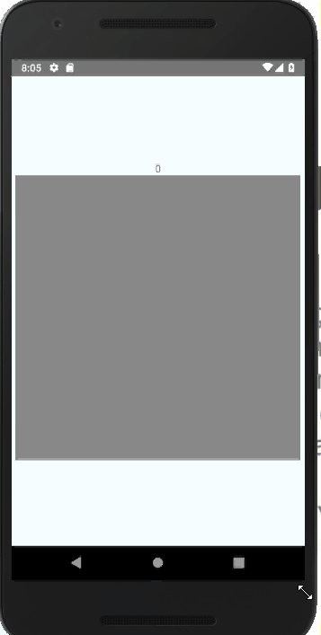

## react-native-scratch-card (Android Only)


#### Thanks for https://github.com/D-clock/ScratchView/

<center>

</center>
## Getting started

`$ npm install react-native-scratch-card --save`

### Mostly automatic installation

`$ react-native link react-native-scratch-card`

### Manual installation

#### Android

1. Open up `android/app/src/main/java/[...]/MainApplication.java`
  - Add `import com.thebylito.RNScratchCardPackage;` to the imports at the top of the file
  - Add `new RNScratchCardPackage()` to the list returned by the `getPackages()` method
2. Append the following lines to `android/settings.gradle`:
  	```
  	include ':react-native-scratch-card'
  	project(':react-native-scratch-card').projectDir = new File(rootProject.projectDir, 	'../node_modules/react-native-scratch-card/android')
  	```
3. Insert the following lines inside the dependencies block in `android/app/build.gradle`:
  	```
      compile project(':react-native-scratch-card')
  	```

## Example
```javascript
import React, { Component } from 'react';
import { StyleSheet, Text, View, Image, Alert } from 'react-native';
import ScratchCard from 'react-native-scratch-card'

export default class App extends Component {
  state = { color: 'red', status: 0 }
  render() {
    return (
      <View style={styles.container}>
        <Text>{this.state.status}</Text>
        <ScratchCard
          brushSize={125}
          getPercent={(percent) => {
            this.setState({ status: percent })
          }}
          onEnd={() => { Alert.alert('acabou!') }}
          maxPercent={50}
          style={{ justifyContent: 'center', alignItems: 'center', width: 400, height: 400 }}
          color={'gray'}
         >
          <Image source={require('./reactImage.png')} resizeMode="contain" />
        </ScratchCard>
      </View>
    );
  }
}

const styles = StyleSheet.create({
  container: {
    flex: 1,
    justifyContent: 'center',
    alignItems: 'center',
    backgroundColor: '#F5FCFF',
  }
});
```
  
